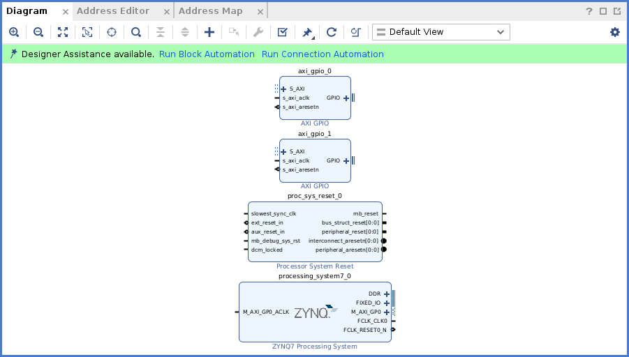
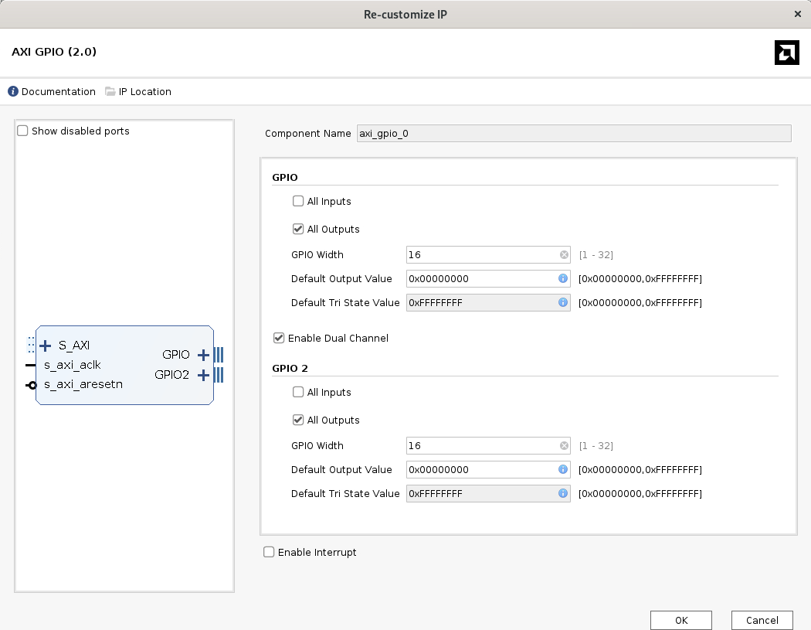
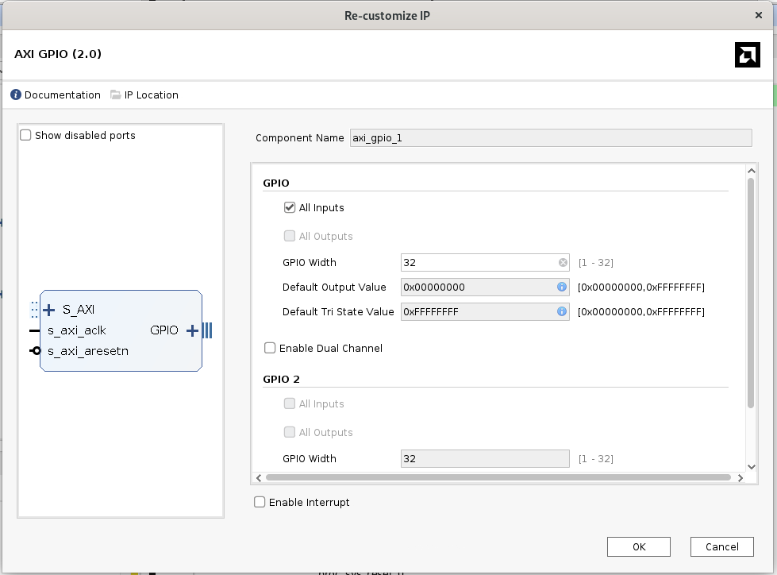
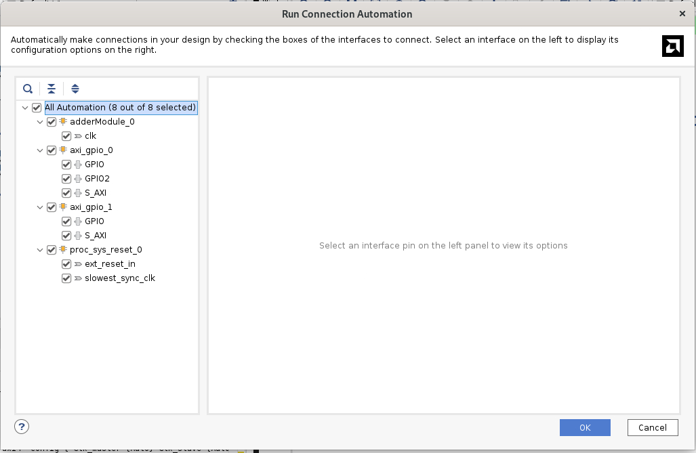
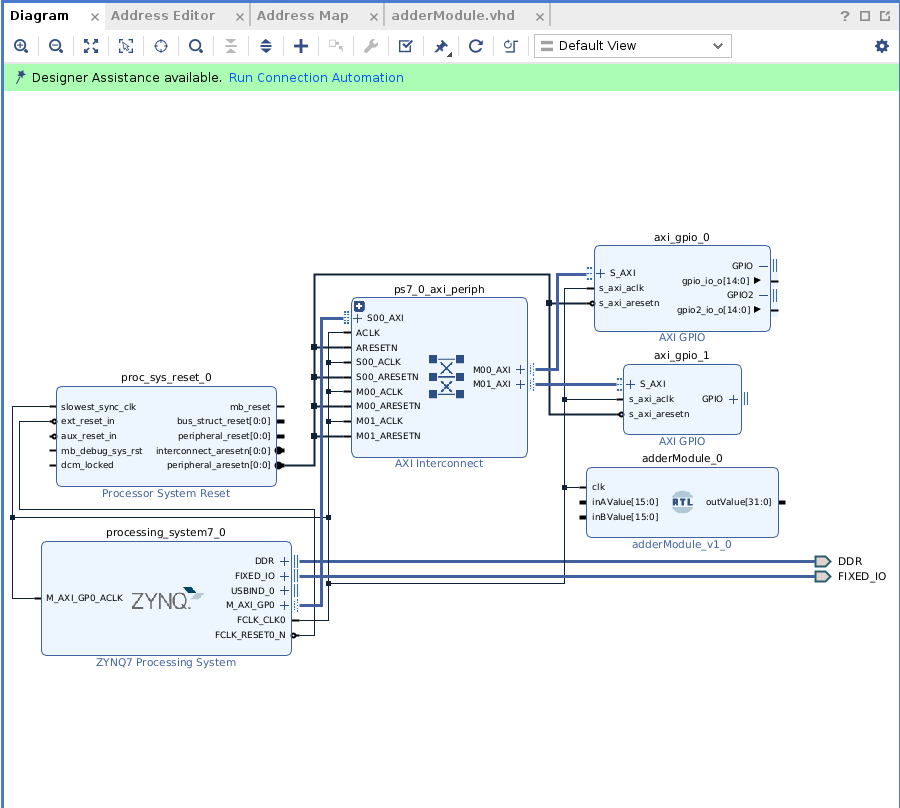
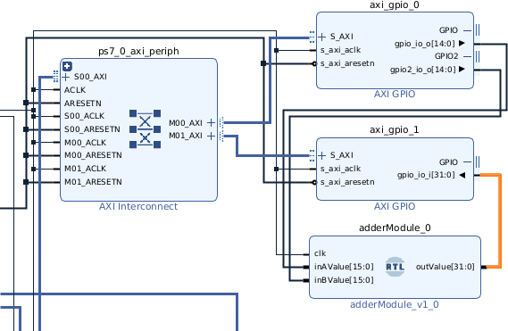

# Adding two numbers

In this tutorial we'll see first how to compose the FPGA design to add to two number, then the necessary instructions to control the FPGA from Jupyter Notebook. In the second section we'll see how to make sums with negative numbers. This is possible thanks to the fact that the FPGA does not have any notion of negative numbers, so it is possible to interpreate a binary number as negative with the rigth operations.

## FPGA Design
The block we need to import are:

- Zynq Processing System
- Processor System Reset
- 2 x Axi GPIO modules



The first step is to tap the "*Run Block Automation*" tab. The Run Block Automation dialog box lets you provide input about basic features that the microprocessor system requires.

Now we need to add the adder module. Before adding it to the project let's how it is structured the VHDL file:

```
library IEEE;
use IEEE.STD_LOGIC_1164.ALL;
use IEEE.STD_LOGIC_ARITH.ALL;
use IEEE.STD_LOGIC_UNSIGNED.ALL;

entity adderModule is
  Port (
    clk : in STD_LOGIC;
    inAValue : in STD_LOGIC_VECTOR(15 downto 0);
    inBValue : in STD_LOGIC_VECTOR(15 downto 0);
    outValue : out STD_LOGIC_VECTOR(31 downto 0)
  );
end adderModule;

architecture Behavioral of adderModule is
  signal signed_inA : signed(15 downto 0);
  signal signed_inB : signed(15 downto 0);
  signal signed_out : signed(31 downto 0);
begin

  process(clk)
  begin
    if rising_edge(clk) then
      signed_inA <= signed(inAValue);
      signed_inB <= signed(inBValue);
      signed_out <= signed_inA + signed_inB;
      outValue <= std_logic_vector(signed_out);
    end if;
  end process;

end Behavioral;

```

First the libraries are stated: 
```
library IEEE;
use IEEE.STD_LOGIC_1164.ALL;
use IEEE.NUMERIC_STD.ALL;
```
- `library IEEE`: This declares that you're using the IEEE library, which contains commonly used packages in digital design.

- `IEEE.STD_LOGIC_1164.ALL`: This imports the STD_LOGIC_1164 package, which defines types like STD_LOGIC and STD_LOGIC_VECTOR. These types are widely used for representing digital signals.
- `IEEE.NUMERIC_STD.ALL`: This imports the numeric_std package, which provides standard arithmetic operations on signed and unsigned numbers. This is preferred over STD_LOGIC_ARITH and STD_LOGIC_UNSIGNED since it's the IEEE standard.

**entity module**: state which are the inputs and the outputs for the module

**architecture Behavioral of adderModule**: defines the internal behavior of the adderModule. The architecture name is Behavioral, indicating that this code defines the functionality without specifying the low-level hardware implementation.

**process(clk)**: A process block is a sequential part of the architecture that will be triggered by changes in the clk signal. In this case, the block runs on every rising edge of the clock. rising_edge(clk) checks if there is a rising edge (transition from 0 to 1) on the clock signal clk. This is how the process is synchronized with the clock.

To add this file to the project you can either create a new VHDL file(*Add Source -> Add or create design sources -> Create file*) or import this [file](/tutorials/resources/adderModule.vhdl) (*Add Source -> Add or create design sources -> Add file*)


Now let's configure the Axi-GPIO modules, we need to configure both the inputs and the outputs.

First we set the outpus (outputs for us, for the FPGA they will be inputs), we need to configure two channels, in order to send to the FPGA the two number, as you can see in this figure I used two channels of 16-bit:



Instead the inputs(still, inputs for us, for the FPGA is an output) will be set to a 32-bit:



Now it is possible to automate most of the connection work by clicking the tab "*Run Connection Automation*" and select all of the connections:



The tab will connect all the possible ports, but we need to modify some of those, first let's disconnect from the AxiGpio modules the rigth ports and delete the created external ports.

In the end the design should look like this:


Now let's connect the Axi GPIO modules correcltly:


## Jupyter Notebook

Now we are ready to create the wrapper and generate the bitstream.
Once the file `.bit`, `.hwh` and `.tcl` (if you want you can find them [here](/tutorials/resources/AddingTwoNumber/)) are on the FPGA, create a Jupyter Notebook.

You can find it [here](/tutorials/resources/AddingTwoNumber/AddingTwoNumber.ipynb).

First things first, so let's initialize the board by resetting it and uploading the bit file:

```
import pynq
pynq.PL.reset()
ol = pynq.Overlay("AddingTwoNumber.bit")
```
Then if we want it is possible to check what are the IP Blocks loaded onto the `.bit` file, this may be useful to understand if the IPs were correctly configured and loaded in the design.

```
help(ol)
```

In this case the output that we expect contains the two Axi Gpio modules and the Processing System:

```<pynq.overlay.Overlay object>
    Default documentation for overlay AddingTwoNumber.bit. The following
    attributes are available on this overlay:
    
    IP Blocks
    ----------
    axi_gpio_0           : pynq.lib.axigpio.AxiGPIO
    axi_gpio_1           : pynq.lib.axigpio.AxiGPIO
    processing_system7_0 : pynq.overlay.DefaultIP
```

Now let's test it, the first two instruction load into the Axi module two values, 32 and 10 and then we register the result into the variable `result`, the it is possible to print it with the `print` function.

```
ol.axi_gpio_0.channel1.write(val=10, mask=0xffff)
ol.axi_gpio_0.channel2.write(val=32, mask=0xffff)

# Assuming 16-bit result
result = ol.axi_gpio_1.channel1.read()

print(result)
--------------------------------------------------------------------------------
42
```

## Adding Negative Numbers

If we try to insert a negative number inside one of the two `axi_gpio_0` channels, we find that the answer is not correct:

```
ol.axi_gpio_0.channel1.write(val=10, mask=0xffff)
ol.axi_gpio_0.channel2.write(val=-32, mask=0xffff)

​

# Assuming 16-bit result

result = ol.axi_gpio_1.channel1.read()
print(result)
​-------------------------------------------------------------------------------
4294967274
```

In order to obtain the correct answer it is necessary to perform a conversion, which can be easely done adding this `if` statement:

```
print(result)

# Convert to signed 32-bit integer if necessary
if result >= 0x80000000:  # 0x80000000 is 2147483648 in decimal, the threshold for negative numbers in 32-bit signed integers
   result -= 0x100000000  # Subtract 4294967296 to convert to the negative range

print(result)
--------------------------------------------------------------------------------
4294967284
-12
```

Congratulations! You've completed the first tutorial.


### Table of Contents

- [Introduction](introduction.md)
- [Resources](resources.md)
  - [.xdc File](resources.md#the-xdc-file)
  - [IP Libraries](resources.md#the-ip-libraries)
- [Important Blocks to Know](important-blocks-to-know.md)
  - [AXI GPIO](/wiki/important-blocks-to-know.md#axi-gpio)
  - [DMA](/wiki/important-blocks-to-know.md#dma)
  - [Zynq Processing System](/wiki/important-blocks-to-know.md#zynq-processing-system) 
  - [Custom Blocks](important-blocks-to-know.md#custom-blocks)
- [Tutorial](/tutorials/Introduction-to-tutorials.md)
  - [Adding Two Numbers](/tutorials/adding-two-numbers.md)
  - [Adding Negative Numbers](/tutorials/adding-two-numbers.md#adding-negative-numbers)
  - [Adding Arrays of Numbers](/tutorials/adding-arrays.md)


