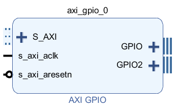
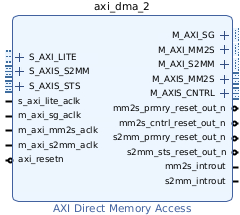
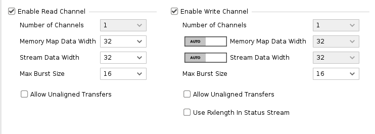
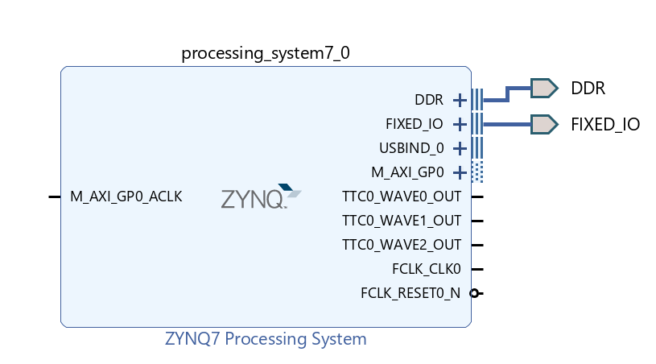

# Important blocks to know

Understanding how certain blocks in Vivado work is essential for gaining better control over the output that the FPGA will produce. That’s why I want to explain the basic functionality of some of the most important blocks in FPGA design. This won't be a deep explanation of the blocks—either because I lack the expertise to do so or because it would take too long to cover everything in detail.

## AXI-GPIO
The AXI GPIO provides a general purpose input/output interface to the AXI (Advanced eXtensible Interface) interface. This 32-bit soft IP core is designed to interface with the AXI4-Lite interface.

This block is fundamental the interact with external input/output source, it has two channels and it is not possible to add more of them. Usually, as you will see in this tutorials, I will use the channel 1 as a trigger and the sample two as a sample counter. 

## DMA
*Direct memory access* (DMA) is a feature of computer systems that allows certain hardware subsystems to access main system memory independently of the central processing unit (CPU). [from wikipedia]

The DMA is a crucial block to store data inside the FPGA memory, it works like a portal that connects the external environment with the memory. 

 

In the DMA is possible to decide whether it is necessary for reading, writing or both by uncheking/checking the correspondent toggle:

## Zynq Processing System

AMD provides the Processing System IP Wrapper for the Zynq™ 7000 to accelerate your design and its configuration for your embedded products

The Processing System IP is the software interface around the Zynq 7000 Processing System. The Zynq 7000 family consists of a system-on-chip (SoC) style integrated processing system (PS) and a Programmable Logic (PL) unit, providing an extensible and flexible SoC solution on a single die.

The Processing System IP Wrapper acts as a logic connection between the PS and the PL while assisting you to integrate custom and embedded IPs with the processing system using the Vivado™ IP integrator. [from the AMD doc page].

## Custom Blocks

It is also possible to configure customs block using VHDL or Verilog, in the case of this tutorial we will use VHDL, but they are quite similar.

Now that we know most of the instruments that we will use let's go test them with the tutorials.
### Table of Contents

- [Introduction](introduction.md)
- [Resources](resources.md)
  - [.xdc File](resources.md#the-xdc-file)
  - [IP Libraries](resources.md#the-ip-libraries)
- [Important Blocks to Know](important-blocks-to-know.md)
  - [AXI GPIO](/wiki/important-blocks-to-know.md#axi-gpio)
  - [DMA](/wiki/important-blocks-to-know.md#dma)
  - [Zynq Processing System](/wiki/important-blocks-to-know.md#zynq-processing-system) 
  - [Custom Blocks](important-blocks-to-know.md#custom-blocks)
- [Tutorial](/tutorials/Introduction-to-tutorials.md)
  - [Adding Two Numbers](/tutorials/adding-two-numbers.md)
  - [Adding Negative Numbers](/tutorials/adding-two-numbers.md#adding-negative-numbers)
  - [Adding Arrays of Numbers](/tutorials/adding-arrays.md)

➡️ [Go to the Next Page](/tutorials/Introduction-to-tutorials.md)

